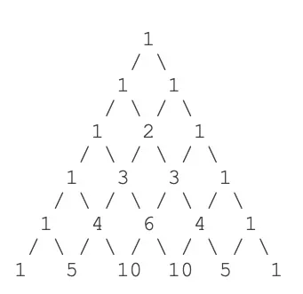

!!! warning "需要审核"
    - 本页面没有经过除作者以外的人的审核。
    - 本页面可能包含知识性错误。
    - 欢迎参与修改页面！

## 引言

我们常用的二项式定理，实际上是对于 $m$ 项式的 $n$ 次展开式中 $m=2$ 的结果。我们是否可根据二项式定理的推导思路，进一步将二项式定理推广至类似的“多项式定理”呢？

下文就将对“多项式定理”进行规律的发现，结论猜想并加以证明。

## 二项式定理

我们知道，有：

$$
(a+b)^n=\sum_{k=0}^n\text C^k_na^{n-k}b^k
$$

即二项式定理。

系统化地推出这个公式，我们可以令展开式中的每一个 $(a+b)$ 中选择 $a$ 的状态为 $0$，选择 $b$ 的状态为 $1$，则我们可以用一个 $n$ 位二进制数表示展开式。

例如下面这个展开式：

$$
(a+b)^2=a^2+2ab+b^2
$$

实际上就是 $(a+b)^2=(a+b)(a+b)$，并在展开的两个因式中选择 $a$ 或 $b$.

两式都选择 $a$：对应项 $a^2$，对应二进制数 $00$.

两式都选择 $b$：对应项 $b^2$，对应二进制数 $11$.

一式选择 $a$，一式选择 $b$：对应项 $ab$，对应二进制数 $01$，$10$.

则显然，对应系数分别可得。

同理对于 $(a+b)^n$ 的展开式中的一项 $a^{n-k}b^k$，其对应的 $n$ 位二进制数中有 $n-k$ 个 $0$，$k$ 个 $1$.

从 $n$ 位中选出 $k$ 个填上 $1$，其余为 $0$，方案为 $\text C^k_n$.

因此就有项 $\text C^k_na^{n-k}b^k$. 于是二项式定理得证。

利用这种思路，我们进一步进行推理。

## 三项式定理

观察到当项数增多后，再像 $\text C^k_na^{n-k}b^k$ 这样表示每一项不方便，于是我们考虑以下表达方式，二项式定理变为：

$$
(a+b)^n=\sum_{0\leqslant k_1,k_2\leqslant n}\text C^{k_1}_na^{k_1}b^{k_2}=\sum_{0\leqslant k_1,k_2\leqslant n}\dfrac{n!}{k_1!k_2!}a^{k_1}b^{k_2}
$$

其中 $k_1+k_2=n$.

同样地，对于 $(a+b+c)^n$ 的展开式中的每一个 $(a+b+c)$，选择 $a$ 的状态为 $0$，选择 $b$ 的状态为 $1$，选择 $c$ 的状态为 $2$，那么我们可以用一个 $n$ 位三进制数表示展开式。

对于其中任意一项 $a^{k_1}b^{k_2}c^{k_3}$，其对应的 $n$ 位三进制数含有 $k_1$ 个 $0$，$k_2$ 个 $1$，$k_3$ 个 $2$. 显然 $k_1+k_2+k_3=n$.

选取的方案数为

$$
\text C^{k_1}_n\text C^{k_2}_{n-k_1}\text C^{k_3}_{n-k_1-k_2}=\dfrac{n!}{k_1!(n-k_1)!}\cdot\dfrac{(n-k_1)!}{k_2!(n-k_1-k_2)!}\cdot\dfrac{(n-k_1-k_2)!}{k_3!(n-k_1-k_2-k_3)!}=\dfrac{n!}{k_1!k_2!k_3!}
$$

于是得出：

$$
(a+b+c)^n=\sum_{0\leqslant k_1,k_2,k_3\leqslant n}\dfrac{n!}{k_1!k_2!k_3!}a^{k_1}b^{k_2}c^{k_3}
$$

其中 $k_1+k_2+k_3=n$.

这样，我们已经发现一点规律了。

## 多项式定理

对于 $\left(\displaystyle\sum^m_{i=1}a_i\right)^n$，对于其每一个 $\left(\displaystyle\sum^m_{i=1}a_i\right)$，用 $i-1$ 表示选择 $a_i$ 的状态，则其展开式可以用一个 $n$ 位的 $m$ 进制数表示。

对于其展开式的每一个状态，其对应的 $n$ 位的 $m$ 进制数均含有 $k_i$ 个 $i-1$，那显然有：

$$
\sum^m_{i=1}k_i=n
$$

同时得到的项为 $\displaystyle\prod^{m}_{i=1}a_i^{k_i}$. 则这个项的个数，即选择的方案数为：

$$
\prod^m_{i=1}\text C^{k_i}_{n-\sum^{m-1}_{j=1}k_j}=\prod^m_{i=1}\left[\dfrac{\left(n-\displaystyle\sum^{m-1}_{j=1}k_j\right)!}{k_i!\left(n-\displaystyle\sum^{m}_{j=1}k_j\right)!}\right]=\dfrac{n!}{\displaystyle\prod^m_{i=1}(k_i!)}
$$

于是得到以下结论：

当 $\displaystyle\prod_{i=1}^{m}a_i\not =0$ 时：

$$
\left(\displaystyle\sum^m_{i=1}a_i\right)^n=\sum_{0\leqslant k_1,k_2,\cdots,k_m\leqslant n}\left(\dfrac{n!}{\displaystyle\prod^m_{i=1}(k_i!)}\displaystyle\prod^{m}_{i=1}a_i^{k_i}\right)
$$

其中 $\displaystyle\sum^m_{i=1}k_i=n$.

我们称以上结论为 **多项式定理**. 它事实上描述了一个 $m$ 项式的 $n$ 次幂的展开式。

## 证明

以上证明虽然没有逻辑上的问题，但总归给人一种不严谨之感。其中诸如为何可以用 $n$ 位的 $m$ 进制数表示状态等问题也不好加以说明，因此我们仍然将以上得出的结论作为猜想，接下来我们用数学归纳法严谨证明这个结论。

首先猜想如上节所说结论。不妨令：

$$
f(n,m)=\left(\displaystyle\sum^m_{i=1}a_i\right)^n
$$

当 $n=0,m=1$ 时：

$$
f(0,1)=(a_1)^0=1
$$

同时由猜想，得

$$
f(0,1)=\sum_{0\leqslant k\leqslant 0}\left(\dfrac{0!}{k!}a_1^k\right)=1
$$

结论成立。

现假设当 $n\leqslant n_0,m\leqslant m_0$ 时，结论成立，其中 $n_0\geqslant 0$，$m_0\geqslant 1$.

即是说：

$$
f(n_0,m_0)=\left(\displaystyle\sum^{m_0}_{i=1}a_i\right)^{n_0}=\sum_{0\leqslant k_1,k_2,\cdots,k_{m_0}\leqslant n_0}\left(\dfrac{n_0!}{\displaystyle\prod^{m_0}_{i=1}(k_i!)}\displaystyle\prod^{m_0}_{i=1}a_i^{k_i}\right)
$$

其中 $\displaystyle\sum^m_{i=1}k_i=n_0$.

考虑 $f(n_0+1,m_0)$. 显然有：

$$
\begin{split}
f(n_0+1,m_0)&=f(n_0,m_0)\cdot\left(\displaystyle\sum^{m_0}_{i=1}a_i\right)
\\&=\left[\sum_{0\leqslant k_1,k_2,\cdots,k_{m_0}\leqslant n_0}\left(\dfrac{n_0!}{\displaystyle\prod^{m_0}_{i=1}(k_i!)}\displaystyle\prod^{m_0}_{i=1}a_i^{k_i}\right)\right]\left(\displaystyle\sum^{m_0}_{i=1}a_i\right)
\\&=\sum^{m_0}_{i=1}\left\{a_i\left[\sum_{0\leqslant k_1,k_2,\cdots,k_{m_0}\leqslant n_0}\left(\dfrac{n_0!}{\displaystyle\prod^{m_0}_{i=1}(k_i!)}\displaystyle\prod^{m_0}_{i=1}a_i^{k_i}\right)\right]\right\}
\\&=\sum_{0\leqslant k_1',k_2',\cdots,k_{m_0}'\leqslant n_0+1}\left(F\prod^{m_0}_{i=1}a_i^{k_i'}\right)
\end{split}
$$

其中 $\displaystyle\sum^m_{i=1}k_i'=n_0+1$，$F$ 为引入的系数。

我们想要证明

$$
f(n_0+1,m_0)=\sum_{0\leqslant k_1,k_2,\cdots,k_{m_0}\leqslant n_0+1}\left(\dfrac{(n_0+1)!}{\displaystyle\prod^{m_0}_{i=1}(k_i!)}\displaystyle\prod^{m_0}_{i=1}a_i^{k_i}\right)
\\\left(其中\displaystyle\sum^m_{i=1}k_i=n_0+1\right)
$$

则只需要证明

$$
F=\dfrac{(n_0+1)!}{\displaystyle\prod^{m_0}_{i=1}(k_i'!)}
$$

而实际上，因为

$$
\begin{split}
Fa_1^{k_1'}a_2^{k_2'}\cdots a_{m_0}^{k_{m_0}'}
&=\dfrac{n_0!}{(k_1'-1)!k_2'!\cdots k_{m_0}'!}a_1^{k_1'-1}a_2^{k_2'}\cdots a_{m_0}^{k_{m_0}'}\cdot a_1
\\&+\dfrac{n_0!}{k_1'!(k_2'-1)!\cdots k_{m_0}'!}a_1^{k_1'}a_2^{k_2'-1}\cdots a_{m_0}^{k_{m_0}'}\cdot a_2
\\&+\cdots
\\&+\dfrac{n_0!}{k_1'!k_2'!\cdots (k_{m_0}'-1)!}a_1^{k_1'}a_2^{k_2'}\cdots a_{m_0}^{k_{m_0}'-1}\cdot a_{m_0}
\end{split}
$$

所以

$$
F=\dfrac{n_0!}{(k_1'-1)!k_2'!\cdots k_{m_0}'!}+\dfrac{n_0!}{k_1'!(k_2'-1)!\cdots k_{m_0}'!}+\cdots+\dfrac{n_0!}{k_1'!k_2'!\cdots (k_{m_0}'-1)!}
$$

但是值得注意的是，因为 $0\leqslant k_1',k_2',\cdots,k_{m_0}'\leqslant n_0+1$，所以若 $k_x'=0$，则上式中：

$$
\dfrac{n_0!}{k_1'!k_2'!\cdots(k_x'-1)!\cdots k_{m_0}'!}
$$

该项不存在。

所以

当 $\displaystyle\prod_{i=1}^{m_0}k_i'\not =0$ 时，有

$$
F=\sum^{m_0}_{i=1}k_i'\cdot\dfrac{n_0!}{\displaystyle\prod^{m_0}_{i=1}(k_i'!)}=\dfrac{(n_0+1)n_0!}{\displaystyle\prod^{m_0}_{i=1}(k_i'!)}=\dfrac{(n_0+1)!}{\displaystyle\prod^{m_0}_{i=1}(k_i'!)}
$$

结论成立。

当 $k_x'=0$ 时，满足：

$$
\sum_{1\leqslant i\leqslant m_0 且i\not= x}k_i'=n_0+1
$$

同时因为有 $k_x'!=1$，所以：

$$
F=\dfrac{n_0!}{(k_1'-1)!k_2'!\cdots k_{x-1}'!k_{x+1}'!\cdots k_{m_0}'!}
+\cdots+\dfrac{n_0!}{k_1'!k_2'!\cdots k_{x-1}'!k_{x+1}'!\cdots (k_{m_0}'-1)!}
$$

并且

$$
\prod_{1\leqslant i\leqslant m_0 且i\not= x}k_i'\not= 0
$$

只需证明：

$$
F=\dfrac{(n_0+1)!}{\displaystyle\prod^{m_0}_{i=1}(k_i'!)}=\dfrac{(n_0+1)!}{\displaystyle\prod_{1\leqslant i\leqslant m_0 且i\not= x}(k_i'!)}
$$

而以上结论已证。

同理，当有多个 $k$ 为 $0$ 时，以上转化均成立，转化后得到的结论亦已证。

综上，有：

$$
f(n_0+1,m_0)=\sum_{0\leqslant k_1,k_2,\cdots,k_{m_0}\leqslant n_0+1}\left(\dfrac{(n_0+1)!}{\displaystyle\prod^{m_0}_{i=1}(k_i!)}\displaystyle\prod^{m_0}_{i=1}a_i^{k_i}\right)
\\\left(其中\displaystyle\sum^{m_0}_{i=1}k_i=n_0+1\right)
$$

接下来考虑 $f(n_0,m_0+1)$. 显然有

$$
\begin{split}
f(n_0,m_0+1)
&=\left(\displaystyle\sum^{m_0}_{i=1}a_i+a_{m_0+1}\right)^{n_0}
\\&=\sum_{0\leqslant X,K\leqslant n_0}\dfrac{n_0!}{X!K!}\left(\sum^{m_0}_{i=1}a_i\right)^{X}a_{m_0+1}^{K}
\end{split}
$$

其中 $X+K=n_0$.

由假设，有

$$
\begin{split}
f(n_0,m_0+1)
&=\sum_{0\leqslant X,K\leqslant n_0}\dfrac{n_0!}{X!K!}\left(\sum^{m_0}_{i=1}a_i\right)^{X}a_{m_0+1}^{K}
\\&=\sum_{0\leqslant X,K\leqslant n_0}\dfrac{n_0!}{X!K!}\left[\sum_{0\leqslant k_1,k_2,\cdots,k_{m_0}\leqslant X}\left(\dfrac{X!}{\displaystyle\prod^{m_0}_{i=1}(k_i!)}\displaystyle\prod^{m_0}_{i=1}a_i^{k_i}\right)\right]a_{m_0+1}^{K}
\\&=\sum_{0\leqslant X,K\leqslant n_0}\left[\sum_{0\leqslant k_1,k_2,\cdots,k_{m_0}\leqslant X}\left(\dfrac{n_0!}{X!K!}\cdot\dfrac{X!}{\displaystyle\prod^{m_0}_{i=1}(k_i!)}\displaystyle\prod^{m_0}_{i=1}a_i^{k_i}\cdot a_{m_0+1}^{K}\right)\right]
\\&=\sum_{0\leqslant k_1,k_2,\cdots,k_{m_0},K\leqslant n_0}
\left(\dfrac{n_0!}{\displaystyle\prod^{m_0}_{i=1}(k_i!)K!}\displaystyle\prod^{m_0}_{i=1}a_i^{k_i}\cdot a_{m_0+1}^K
\right)
\end{split}
$$

其中

$$
\sum^{m_0}_{i=1}k_i=X
$$

若令 $K=k_{m_0+1}$，就得到：

$$
f(n_0,m_0+1)=\sum_{0\leqslant k_1,k_2,\cdots,k_{m_0},k_{m_0+1}\leqslant n_0}
\left(\dfrac{n_0!}{\displaystyle\prod^{m_0+1}_{i=1}(k_i!)}\displaystyle\prod^{m_0+1}_{i=1}a_i^{k_i}
\right)
\\\left(其中\displaystyle\sum^{m_0+1}_{i=1}k_i=n_0\right)
$$

综合以上证明，原结论得证。

最终我们得到 **多项式定理**：

当 $\displaystyle\prod_{i=1}^{m}a_i\not =0$ 时：

$$
\left(\displaystyle\sum^m_{i=1}a_i\right)^n=\sum_{0\leqslant k_1,k_2,\cdots,k_m\leqslant n}\left(\dfrac{n!}{\displaystyle\prod^m_{i=1}(k_i!)}\displaystyle\prod^{m}_{i=1}a_i^{k_i}\right)
$$

其中 $\displaystyle\sum^m_{i=1}k_i=n$.

## 应用

我们可以利用多项式定理得到一些简单的结论。

$$
m^n=\sum_{0\leqslant k_1,k_2,\cdots,k_m\leqslant n}\dfrac{n!}{\displaystyle\prod^m_{i=1}(k_i!)}
\\\left(其中\displaystyle\sum^{m}_{i=1}k_i=n\right)
$$

同理我们也可以进行对多项式展开式的某项系数的快速求解

比如 $(a+2b+3c)^5$，其中 $a^2bc^2$ 这一项的系数就为 $\dfrac{5!}{2!1!2!}\times 2\times 3^2=540$.

又如著名的杨辉三角形：

每个点上的数为上一行两个与其相连的数的和。

设第 $n$ 行第 $m$ 个数为 $S_{n,m}$. 则

$$
S_{n,m}=S_{n-1,m-1}+S_{n-1,m}
$$

以上为其递推公式，同时易得其通项公式

$$
S_{n,m}=\text C_{n-1}^{m-1}=\dfrac{(n-1)!}{(n-m)!(m-1)!}
$$

同样地，还有杨辉三棱锥

三棱锥的每个侧面都是一个杨辉三角。

三棱锥内部的每个点上的数都是其上一层与其相连的数之和。

设第 $n$ 层（1-1-1 为第 2 层）第 $m$ 行第 $k$ 个数为 $S_{n,m,k}$，则递推公式为

$$
S_{n,m,k}=S_{n-1,m-1,k-1}+S_{n-1,m-1,k}+S_{n-1,m,k}
$$

通项公式为

$$
S_{n,m,k}=\dfrac{(n-1)!}{(n-m)!(m-k)!(k-1)!}
$$

显然，这个结论可以推广到多维。

以下为个人猜想，尚无证明。

在 $n$ 维空间中存在一个这样的图形，该图形的每个点上有数字 $S_{a_1,a_2,\cdots,a_n}$.

那么存在通项公式：

$$
S_{a_1,a_2,\cdots,a_n}=\dfrac{(a_1-1)!}{(a_1-a_2)!(a_2-a_3)!\cdots(a_{n-1}-a_n)!(a_n-1)!}
$$

同时也存在递推公式：

$$
S_{a_1,a_2,\cdots,a_n}=S_{a_1-1,a_2,\cdots,a_n}+S_{a_1-1,a_2-1,a_3,\cdots,a_n}+\cdots+S_{a_1-1,a_2-1,a_3-1,\cdots,a_{n-1}-1,a_n}+S_{a_1-1,a_2-1,\cdots,a_n-1}
$$

可以证明的是以上两个公式并不矛盾。

---
!!! summary "页面作者"
    [W_LXA_G](mailto:W_LXA_G@163.com)