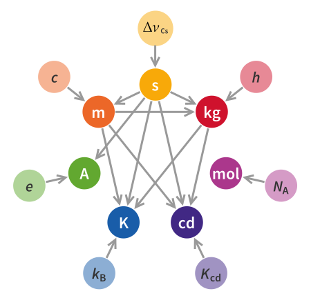

!!! warning "需要审核"
    - 本页面没有经过除作者以外的人的审核。
    - 本页面可能包含知识性错误。
    - 欢迎参与修改页面！

# 2019-SI

## 前言

在2019年，七个国际单位制（the International System of Units）的基本单位被重新定义，此次重定义与之前的基本单位的定义相比有原则上的改变：以前的基本单位多通过人造标准原器（如国际千克原器），而此次**通过严格定义自然界中的七个基本物理常数的数值来得七个基本物理单位**。至此，基本单位的定义不再依赖于实物，而是依赖于物理规律，从而能够在保持这些基本单位的值可以被持续使用。

上图为旧SI制，下图为2019新SI制

- 注：在新SI中，米、秒、坎德拉与旧定义实际相同，而千克、开尔文、摩尔、安培的定义是全新的。

## SI基本单位介绍

### 1.时间：秒(second)

!!! summary "秒的定义"

    铯-133原子在不受干扰的情况下基态的两个超精细能阶间跃迁对应辐射的9 192 631 770个周期的持续时间为一秒(second)  
    即：$1s=\frac{9~192~631~770}{\Delta{\nu_{Cs}}}$  

### 2.长度：米(Metre)

**基于狭义相对论中的光速不变原理，我们定义光在真空中的传播速度c严格等于299 792 458 m/s。**  

因此米就可以用 $c和\Delta{\nu_{Cs}}$ 导出：

!!! summary "米的定义"

    光在真空中在$299792458^{-1}s$内所经过的距离即为一米(metre)  
    即：$1m=\frac{9~192~631~770c}{299~792~458 \Delta{\nu_{Cs}}}$

### 3.质量：千克(Kilogram)

**我们定义普朗克常数h严格等于 $6.626~070~15×10^{-34}J \cdot s$ 。**  

因此利用质能关系 $E=mc^2$ 和光量子假说 $E=h\nu$，我们就可以用 $c、\Delta{\nu_{Cs}}和h$ 导出千克的定义：  

!!! summary "千克的定义"

    一千克即为与频率等于 $1.356~392~489~652×10^50Hz$ 的光子所具有的能量相同时的物体的质量
    即：$1kg=\frac{(299~792~458)^2 h \Delta \nu_{Cs}}{(6.626~070~15×10^{-34}) (9~192~631~770)c^2}$

- 旧定义：我们通过制造一个国际千克原器，以它的质量来代表标准的一千克，然而随着时间的流逝，即使保存在相当严格的条件下，其质量还是发生了微小的变化。现在国际千克原器的不确定度在 $10^{-8}$ 量级。

### 4.电流: 安培(Ampere)

**我们定义电子所带电荷量严格e等于$1.602~176~634×10^{-19}C=1.602~176~634×10^{-19}A \cdot s$。**  

因此根据电流强度的定义（每秒内通过横截面的电荷量），即可利用 $e和\Delta{\nu_{Cs}}$ 导出安培的定义：

!!! summary "安培的定义"

    一安培定义为每秒横截面通过 $\frac{1}{1.602~176~634×10^{-19}} ~C$ 的电荷量时的电流强度。
    即：$1A=\frac{e \Delta \nu_{Cs}}{(1.602~176~634×10^{-19})(9~192~631~770)}$

在此定义下，真空介电常数 $\epsilon_0$ 和真空磁导率 $\mu-_0$ 将具有不确定度。(附：它们满足关系式 $\epsilon_0 \mu_0=\frac{1}{c^2}$)  
（注：介电常数是表征一个介质材料极化率的属性量）
  
- 旧定义：在真空中，截面积可忽略的两根相距1米的平行而无限长的圆直导线内，通以等量恒定电流，导线间相互作用力在1米长度上为 $2×10^{-7}$牛时，则每根导线中的电流为1安培。

### 5.温度：开尔文(Kelvin)

**我们定义玻尔兹曼常数严格等于 $1.380~649×10^{-23}J/K$** 。其中,焦耳这一单位可以由质量、长度和时间的单位导出。

!!! summary "温度的定义"

    开尔文定义为使得玻尔兹曼常数等于$1.380~649×10^{-23}J/K$时的数值。
    即：$1K=\frac{1.380 649×10^{-23} h\Delta \nu_{Cs}}{(6.626 070 15×10^{-34})(9 192 631 770)k}$

- 旧定义: 我们规定水的三相点（固、液、气共存态）温度为263.16K。

### 6.物质的量：摩尔(Mole)

**我们定义阿伏伽德罗常数严格等于 $6.022~140~76×10^{23}$。**  

!!! summary "摩尔的定义"

    一摩尔是精确包含 $6.02214076×10^{23}$ 个原子或分子等基本单元的系统的物质的量。

按此定义，碳12的摩尔质量不再严格等于 $12g/mol$ 。

- 旧定义：摩尔是一系统的物质的量，该系统中所包含的基本单元数与0.012kg碳-12的原子数目相等。

### 7.光度：坎德拉(Candela)

**我们定义频率为 $540 \times 10^{12}$ 的单色辐射光源的发光效率为683 lm/W。**  
流明（lm）是光通量的国际单位。它是根据坎德拉球面角度（cd乘以sr）定义的。一流明是相当数量光散发在1球面角单位，从光源向各个方向发散出等量能量，并且强度是1cd。

!!! summary "坎德拉的定义"

    一坎德拉是频率为 $540 \times 10^{12}$ 的单色辐射光源在某一给定方向上的辐射强度为683 W/sr 时在该方向的发光强度。

---
!!! summary "页面作者"
    [Feng Bocheng](mailto:bochengfeng.phy@stu.pku.edu.cn)
